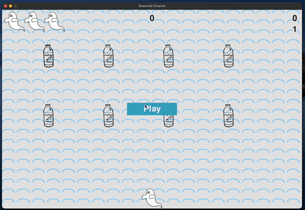
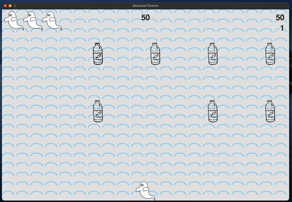
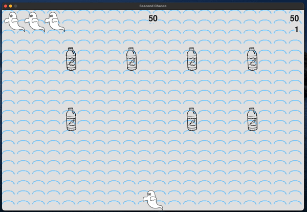

# 🌊 Seacond Chance
Seacond Chance is a game that raises awareness about environmental pollution. Players control ghosts who once died due to pollution and now have a second chance to fix the world by preventing further pollution.

## 👻 Introduction
> In Seacond Chance, the player controls a ghost that appears at
the bottom center of the screen. The player can move the ghost
right and left using the arrow keys and interact with objects using the
spacebar. The objective is to prevent people from throwing plastic bottles into the ocean and clean up existing pollution to score points.
When the game starts, a group of plastic bottles emerges, moving horizontally and vertically on the screen. The player must shot the bottles. Successfully stopping all the bottles will trigger a new, faster-moving group. If a bottle collides with the player's ghost or reaches the bottom of the screen, the player loses a life. The game ends if the player loses three lives.

## 🥤 Controls

- Space-bar
  - Interact

- Arrow keys (left - right)
  - Move the ghost left / right

## 🔧 Requirements
- [Python](https://www.python.org/) 3.1 +
- [Pygame](https://www.pygame.org/)